# 🤖 AI Software Development Agent

An AI-powered software development assistant built using:

- Streamlit
- Groq API
- Python
- OpenAI SDK

## Features

✅ AI Chat  
✅ PDF Summarizer  
✅ Code Generator  
✅ Bug Fixer  
✅ Code Explainer  
✅ Code Runner  

## Technologies Used

- Python
- Streamlit
- Groq API
- LangChain
- HuggingFace Embeddings
- FAISS

## Run Locally

```bash
pip install -r requirements.txt
streamlit run streamlit_app.py

## Screenshots

### Home Page
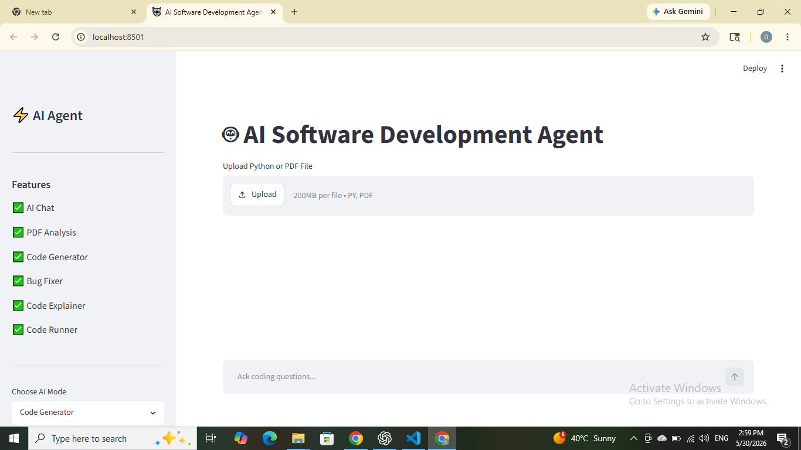

### AI Chat
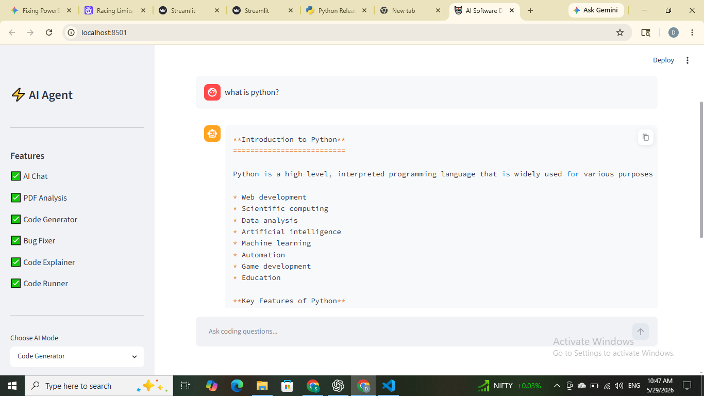

### AI Chat Example
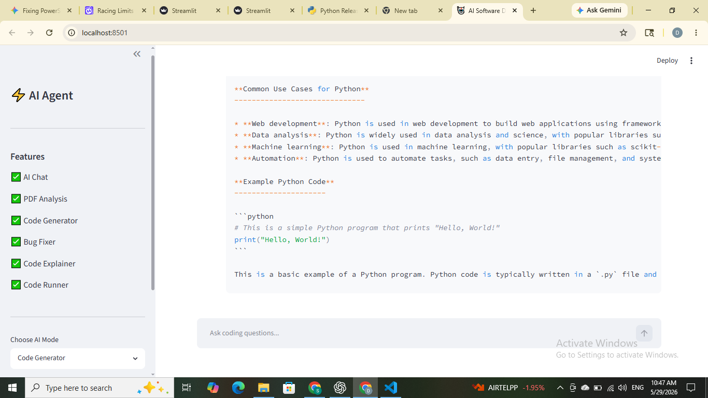

### PDF Upload
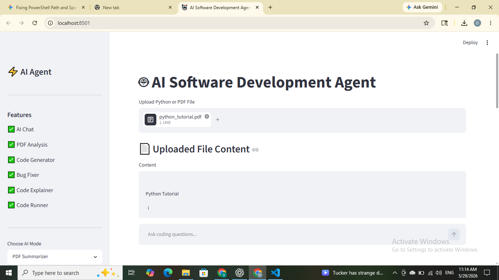

### PDF Summary
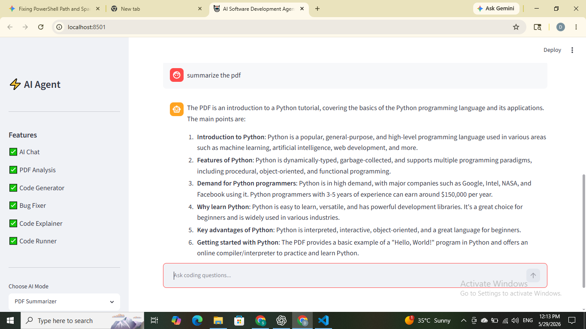

### Code Generator
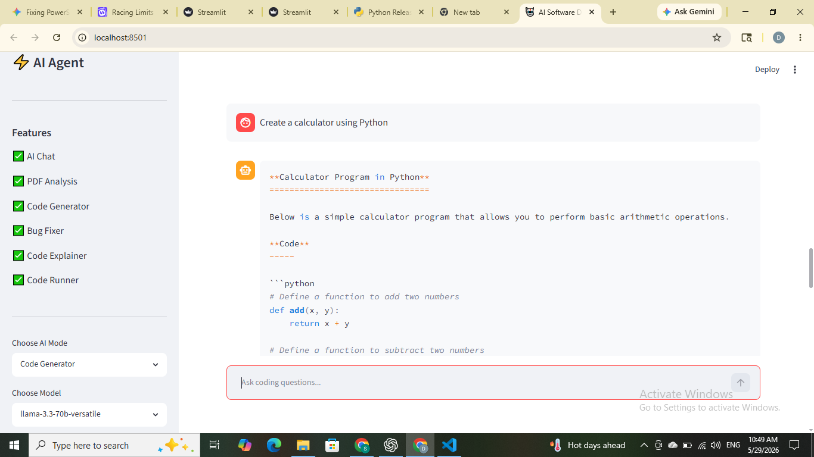

### Code Generator Example 1
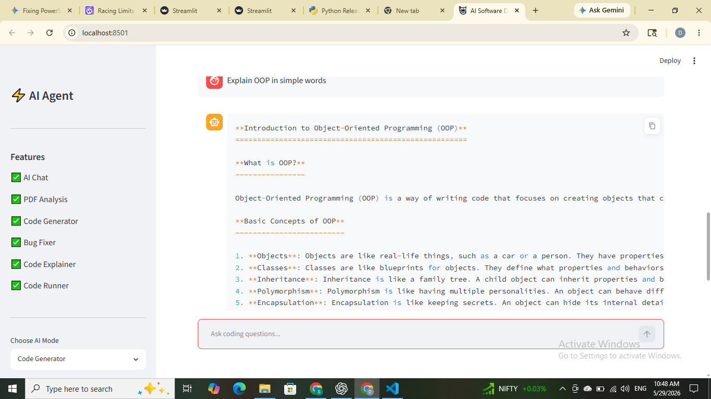

### Code Generator Example 2
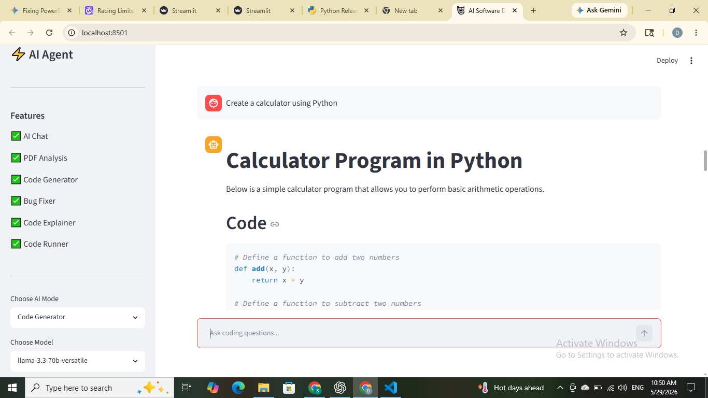

### Bug Fixer
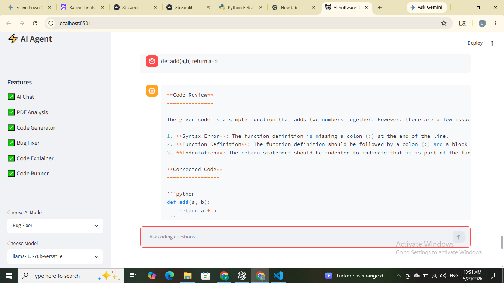

### Code Runner
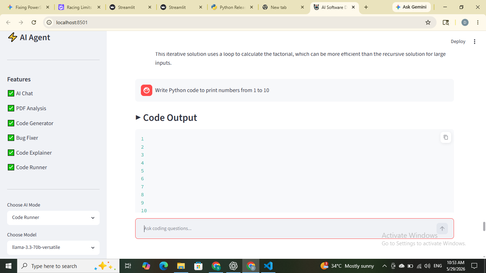

### Code Explainer
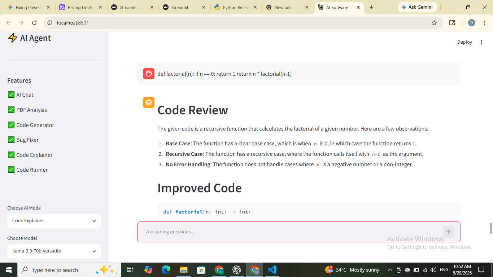